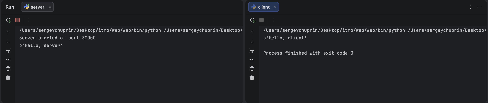

# Задание 1 - Обмен сообщениями по UDP

### Задача

Реализовать клиентскую и серверную часть приложения. Клиент отправляет серверу сообщение
«Hello, server», и оно должно отобразиться на стороне сервера. В ответ сервер отправляет
клиенту сообщение «Hello, client», которое должно отобразиться у клиента.

Требования:

- обязательно использовать библиотеку `socket`;
- реализовать с помощью протокола UDP.

### Теория

UDP — протокол без установления соединения: отправитель просто посылает датаграмму,
не дожидаясь подтверждения от получателя. Это быстрее TCP, но не гарантирует ни доставку,
ни порядок пакетов. Для простого обмена сообщениями этого достаточно. Поэтому сервер
не вызывает `listen()`/`accept()`, а сразу читает датаграммы методом `recvfrom()`,
который возвращает данные и адрес отправителя. По этому адресу сервер отвечает
методом `sendto()`.

Сокет создаётся с параметрами `socket.AF_INET` (IPv4) и `socket.SOCK_DGRAM` (UDP).

### Код сервера

```python
import socket

server = socket.socket(socket.AF_INET, socket.SOCK_DGRAM)

server.bind(('localhost', 30000))

print('Server started at port 30000')
while True:
    data, address = server.recvfrom(1024)
    print(data)
    server.sendto(b'Hello, client', address)
```

### Код клиента

```python
import socket

client = socket.socket(socket.AF_INET, socket.SOCK_DGRAM)

client.sendto(b'Hello, server', ('localhost', 30000))
answer, _ = client.recvfrom(1024)

print(answer)
```

### Запуск

Из папки `task1` в двух разных терминалах:

```bash
python3 server.py
```

```bash
python3 client.py
```

### Пример


