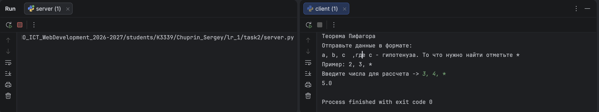

# Задание 2 - Вычисления через TCP

### Задача

Реализовать клиентскую и серверную часть приложения. Клиент запрашивает выполнение
математической операции, параметры которой вводятся с клавиатуры. Сервер обрабатывает
данные и возвращает результат клиенту.

Требования:

- обязательно использовать библиотеку `socket`;
- реализовать с помощью протокола TCP.

Вариант 1: **теорема Пифагора** — по двум известным сторонам прямоугольного треугольника
найти третью.

### Теория

TCP, в отличие от UDP, требует установления соединения перед обменом данными и
гарантирует доставку и порядок байт. Поэтому параметры, введённые пользователем
на клиенте, надёжно дойдут до сервера, а результат вычисления — обратно. Сервер создаёт сокет
`socket.SOCK_STREAM`, привязывает его к адресу (`bind()`), переводит в режим
ожидания (`listen()`) и принимает подключения методом `accept()`, который возвращает
отдельный сокет для общения с конкретным клиентом. Клиент подключается методом
`connect()`, после чего стороны обмениваются данными через `send()`/`recv()`.

Логика обмена:

1. После подключения сервер отправляет клиенту инструкцию по формату ввода.
2. Клиент вводит три значения через `", "` в порядке `a, b, c`, где `c` — гипотенуза,
   а неизвестная сторона обозначается `*`.
3. Сервер определяет, какую сторону нужно найти, и считает:
    - гипотенузу: `c = √(a² + b²)`;
    - катет: `a = √(c² − b²)` или `b = √(c² − a²)`.
4. Сервер отправляет результат и закрывает соединение.

### Код сервера

```python
import socket
import math

server = socket.socket(socket.AF_INET, socket.SOCK_STREAM)
server.bind(('localhost', 30_001))
server.listen()

while True:
    socket_for_client, address = server.accept()
    text = 'Теорема Пифагора\nОтправьте данные в формате: \na, b, c' \
            '\t ,где c - гипотенуза. То что нужно найти отметьте * \n' \
            'Пример: 2, 3, *'
    socket_for_client.send(text.encode('utf-8'))
    try:
        data = socket_for_client.recv(1024).decode('utf-8').split(', ')
        if data[0] == '*':
            answer = math.sqrt( float(data[2]) ** 2 - float(data[1]) ** 2 )
            socket_for_client.send(str(answer).encode('utf-8'))
        elif data[1] == '*':
            answer = math.sqrt( float(data[2]) ** 2 - float(data[0]) ** 2 )
            socket_for_client.send(str(answer).encode('utf-8'))
        elif data[2] == '*':
            answer = math.sqrt(float(data[0]) ** 2 + float(data[1]) ** 2)
            socket_for_client.send(str(answer).encode('utf-8'))
        else:
            socket_for_client.send('Неверный формат, попробуйте еще раз'.encode('utf-8'))
        socket_for_client.close()
    except:
        socket_for_client.close()
```

### Код клиента

```python
import socket

client = socket.socket(socket.AF_INET, socket.SOCK_STREAM)

client.connect(('localhost', 30_001))

info = client.recv(1024).decode('utf-8')
print(info)
data = input('Введите числа для рассчета -> ')
client.send(data.encode('utf-8'))
result = client.recv(1024)
print(result.decode('utf-8'))
```

### Запуск

Из папки `task2` в двух разных терминалах:

```bash
python3 server.py
```

```bash
python3 client.py
```

Пример ввода: `3, 4, *` — сервер вернёт `5.0`.

### Пример


