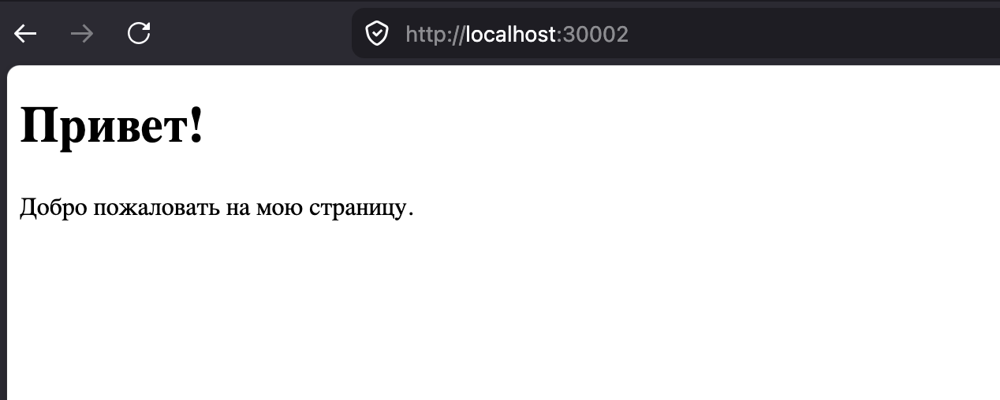

# Задание 3 - Раздача HTML-страницы по HTTP

### Задача

Реализовать серверную часть приложения. Клиент подключается к серверу и в ответ
получает HTTP-сообщение, содержащее HTML-страницу, которую сервер подгружает
из файла `index.html`.

Требования:

- обязательно использовать библиотеку `socket`.

### Теория

HTTP работает поверх TCP и представляет собой текстовый протокол. Ответ сервера состоит из:

1. **стартовой строки** — версия протокола, код и текст статуса (`HTTP/1.1 200 OK`);
2. **заголовков** — например, `Content-Type` (тип содержимого) и `Content-Length`
   (длина тела в байтах);
3. **пустой строки** (`\r\n`), отделяющей заголовки от тела;
4. **тела** — в данном случае содержимого HTML-файла.

Сервер читает `index.html`, формирует заголовки, отправляет ответ одним сообщением
и закрывает соединение. Поскольку ответ — корректное HTTP-сообщение, страницу
можно открыть не только клиентским скриптом, но и в браузере.

### Код сервера

```python
import socket

server = socket.socket(socket.AF_INET, socket.SOCK_STREAM)
server.bind(('localhost', 30_002))
server.listen()

while True:
    socket_for_client, addr = server.accept()

    with open('index.html', 'r') as file:
        html = file.read().encode('utf-8')

    headers = "HTTP/1.1 200 OK\r\n" \
            "Content-Type: text/html\r\n" \
            f"Content-Length: {len(html)}\r\n" \
            "\r\n".encode('utf-8')

    socket_for_client.send(headers + html)

    socket_for_client.close()
```

### HTML-страница

```html
<!DOCTYPE html>
<html lang="ru">
<head>
    <meta charset="UTF-8">
    <title>Приветствие</title>
</head>
<body>
    <h1>Привет!</h1>
    <p>Добро пожаловать на мою страницу.</p>
</body>
</html>
```

### Код клиента

```python
import socket

client = socket.socket(socket.AF_INET, socket.SOCK_STREAM)

client.connect(('localhost', 30_002))

print(client.recv(1024).decode('utf-8'))

client.close()
```

### Запуск

Из папки `task3` (сервер открывает `index.html` по относительному пути):

```bash
python3 server.py
```

Затем в другом терминале:

```bash
python3 client.py
```

или открыть в браузере адрес `http://localhost:30002`.

### Пример


