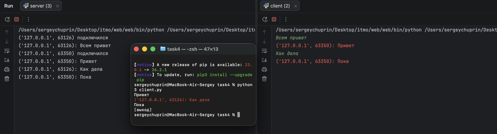

# Задание 4 - Многопользовательский чат

### Задача

Реализовать двухпользовательский или многопользовательский чат. Для максимального
количества баллов реализовать многопользовательский чат.

Требования:

- обязательно использовать библиотеку `socket`;
- для многопользовательского чата необходимо использовать библиотеку `threading`;
- должна быть возможность идентифицировать пользователей;
- пользователь должен иметь возможность выйти из чата.

Реализация на протоколе TCP оценивается в 100% баллов, на UDP — в 80%.
В работе чат реализован на **TCP**.

### Теория

Чат отличается от предыдущих заданий тем, что сервер обслуживает не одного клиента,
а нескольких одновременно. Сервер держит список активных подключений и рассылает
входящие сообщения всем, кроме отправителя.

Операции `accept()` и `recv()` блокирующие: пока программа ждёт данные от одного
клиента, она не может обслуживать других. Поэтому каждое подключение обрабатывается
в отдельном потоке (`threading.Thread`).

**Сервер:**

- в главном цикле принимает подключения и сохраняет сокет клиента в словарь
  `all_clients`, где ключ — адрес клиента `(ip, порт)`;
- для каждого клиента запускает поток `chat_worker`, который читает сообщения
  и рассылает их всем остальным участникам с указанием адреса отправителя;
- изменение общего словаря при удалении клиента защищено блокировкой `threading.Lock`.

**Клиент** тоже использует два потока:

- фоновый поток `get_answers` постоянно принимает сообщения от сервера и выводит
  их красным цветом (библиотека `colorama`);
- основной поток читает ввод пользователя и отправляет его на сервер.
  Команда `[выход]` закрывает соединение и завершает клиент.

**Идентификация пользователей:** каждое сообщение приходит остальным участникам
с префиксом — адресом отправителя `(ip, порт)`, который уникален для каждого подключения.

Клиент — один скрипт `client.py`, который каждый пользователь запускает как отдельный
процесс. За одновременную работу нескольких подключений отвечает сервер.

### Код сервера

```python
import socket
import threading

server = socket.socket(socket.AF_INET, socket.SOCK_STREAM)
server.bind(('localhost', 40_000))
server.listen()

all_clients = dict()
lock = threading.Lock()

def chat_worker(client, address):
    try:
        while True:
            message = client.recv(1024)
            if not message:
                break
            else:
                for addr in all_clients:
                    if addr != address:
                        text = f'{address}: {message.decode("utf-8")}'
                        all_clients[addr].send(text.encode("utf-8"))
                print(f'{address}: {message.decode("utf-8")}')
    except:
        with lock:
            all_clients.pop(address)
        client.close()
        print(f'{address} отключился')


while True:
    client, address = server.accept()
    print(f'{address} подключился')
    all_clients[address] = client

    t = threading.Thread(target=chat_worker, args=(client, address))
    t.start()
```

### Код клиента

```python
import socket
import threading
from colorama import init, Fore, Style
init()

client = socket.socket(socket.AF_INET, socket.SOCK_STREAM)

client.connect(('localhost', 40_000))

def get_answers():
    while True:
        try:
            answer = client.recv(1024)
            if not answer:
                break
            print(Fore.RED + answer.decode('utf-8') + Style.RESET_ALL)
        except:
            break

t = threading.Thread(target=get_answers)
t.start()

while True:
    message = input('')
    if message == '[выход]':
        client.close()
        break
    client.send(message.encode('utf-8'))
```

### Запуск

Клиенту нужна библиотека `colorama`:

```bash
pip install colorama
```

Из папки `task4` запустить сервер:

```bash
python3 server.py
```

Затем в нескольких терминалах запустить клиентов (один и тот же скрипт):

```bash
python3 client.py
```

### Пример


